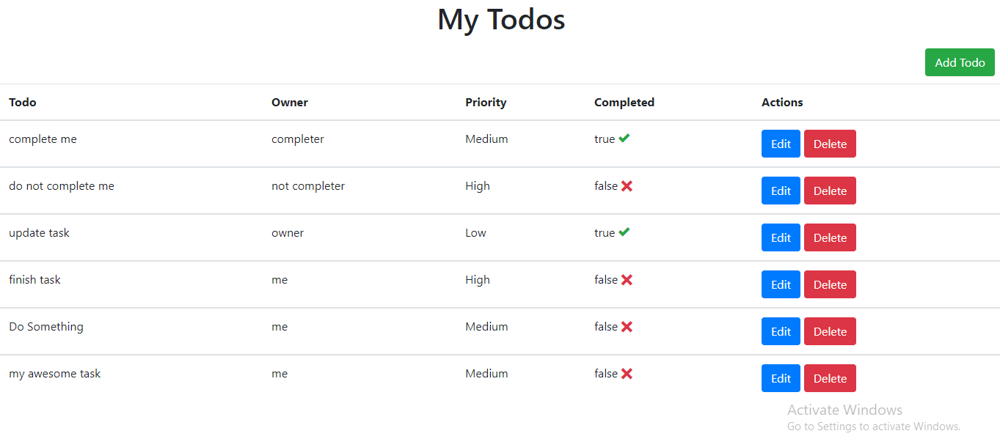
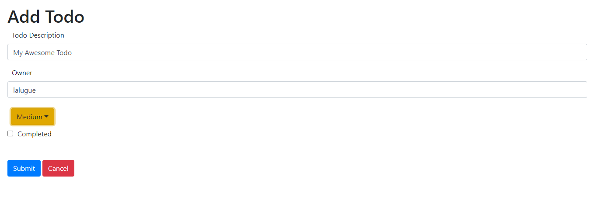
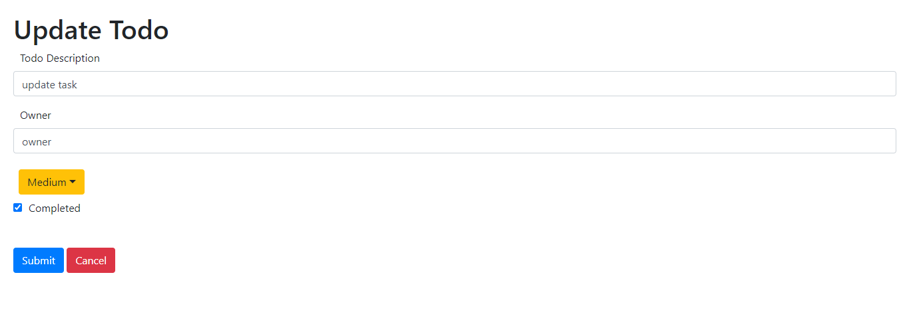
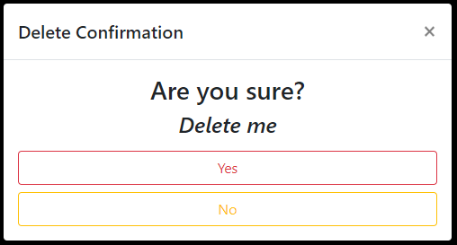

# vue-crud

A prototype CRUD interface now in Vue and Bootstrap!

## How to install

Once downloaded, run the following command:
```
npm install
```

Pairs with a previously created MERN backend! Grab it here:
[mern-crud-backend](https://github.com/lalugue/mern-crud-backend)


## How to run with hot-reloads for development
```
npm run serve
```

## Screenshots









## Additional notes

### Todo (pun not intended)

- Add "client-side" form validation
- Add pretty design stuff

### Compiles and minifies for production
```
npm run build
```

### Lints and fixes files
```
npm run lint
```

### Customize configuration
See [Configuration Reference](https://cli.vuejs.org/config/).
